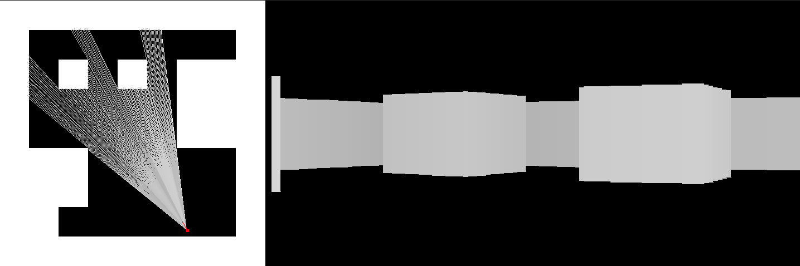

# Simple raycaster
A simple ray caster made using C++ and SDL2.

The camera can be controlled with either WASD or the arrow keys. A visualization of the rays casting on the map is shown on the left and the result is on the right.

The `options.h` file can be changed (before compilation) to either increase/decrease the amount of rays and the FOV of the camera, among other parameters. 

The map files contain of the following values:
- Two values representing the initial player X and Y position (in px)
- Two values representing the width and height of the map.
- A matrix of 1's and 0's representing either a wall or empty space respectively.

Compile using `make`.
Run using `./raycaster {file_name}`

Requires [SDL2](https://www.libsdl.org/).

TODO
- Collision detection
- Smarter(/faster) raycasting
- Textures
